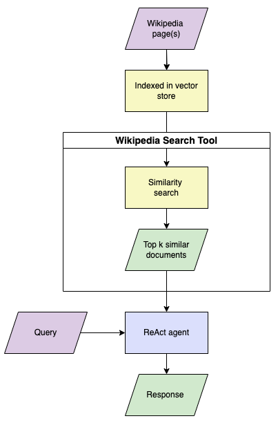
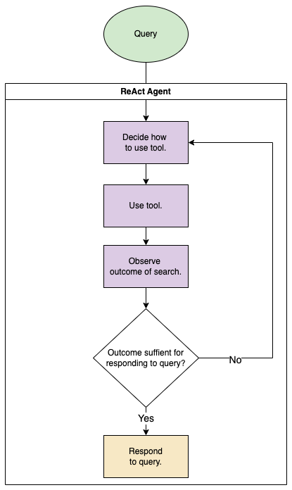

# Wiki ChatBot

[](https://github.com/BrianLusina/wiki-chatbot/actions/workflows/build.yml)
[](https://github.com/BrianLusina/wiki-chatbot/actions/workflows/lint.yml)
[](https://github.com/BrianLusina/wiki-chatbot/actions/workflows/tests.yaml)

A chat assistant that utilizes Retrieval Augmented Generation (RAG) to answer questions based on a Wikipedia page of 
your choice. RAG has proven to be an effective method for reducing hallucinations and providing large language models 
(LLMs) with up-to-date knowledge without the need for retraining. The end-to-end workflow of the chat assistant can be 
seen below:



This will employ the ReAct (Reasoning and Act) prompting framework. This framework assists the agent in reasoning about 
tool usage, observing the outcomes of the tool usage, and then responding appropriately to answer the question, as shown 
below:



## Pre-requisites

1. Ensure that you have at least [Python version 3.12.0](https://www.python.org/) setup locally, you can set this up
   using [pyenv](https://github.com/pyenv/pyenv) if you have multiple versions of Python on your local development
   environment.
2. [Poetry](https://python-poetry.org/) is used for managing dependencies, ensure you have that setup locally.
3. [Virtualenv](https://virtualenv.pypa.io/) Not a hard requirement as poetry should setup a virtual environment for
   you, but can be used as well to setup a virtual environment.
4. [OpenAI API Key](https://openai.com/). Register on OpenAI and setup an API Key. This is going to be
   used with interacting with the API. If you already have an account, then this step can be skipped.

## Setup

1. After cloning the project, install the dependencies required with:

   ```shell
   poetry install
   ```
   > When using poetry

   Or
   ```shell
   make install
   ```
   > When using [GNU Make](https://www.gnu.org/s/make/manual/make.html), this is a wrapper around the top commend

2. Setup secrets in a _secrets.ini_ file from a sample [secrets.ini.sample](secrets.ini.sample). This can be done with
   the command:

   ```shell
   cp secrets.ini.sample secrets.ini
   cp apikeys.yml.sample apikeys.yml
   ```

   > Copies over the sample file to a newly created file secrets.ini file. Note that this file is not pushed to a VCS.

   The file should look like this:

   ```ini
   [openai]
   base_url=https://api.openai.com
   api_key=<YOUR-OPENAI-API-KEY>
   ```

   ```yaml
   openai:
    api_key:
   ```

   > Enter your Open AI API Key in the provided placeholder(s). You can optionally change the base url, but this is
   already defaulted

3. Install `chatbot` in editable mode:
   ```shell
   cd chatbot
   pip install -e .
   ```

## Execution

To execute `chatbot`, go ahead and run the below command:

```shell
python chatbot --help
```
